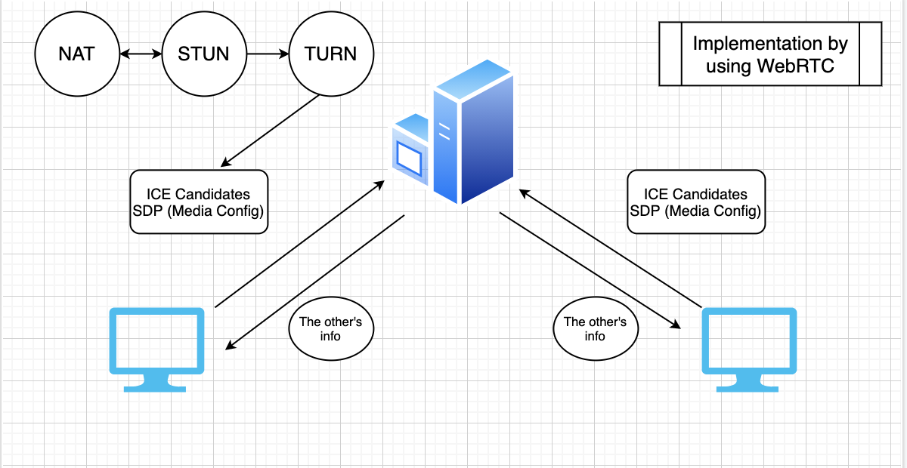

# GO-RTC SERVICES IMLPEMENTATION

---

## DESCRIPTION

Go RTC is a webservice providing real-time communication activities such as:

- Video Calling Service
- Messaging Service
- File (.txt) Storing Service
- File Search (Personal - In System)

All services are completely free of charge. To have an account to sign-in, please contact the information at the bottom of this page.

---

## USAGE

To-be updated (later)

---

## CLEAN ARCHITECTURE

- Independent of Frameworks. The architecture does not depend on the existence of some library of feature laden software. This allows you to use such frameworks as tools, rather than having to cram your system into their limited constraints.
- Testable. The business rules can be tested without the UI, Database, Web Server, or any other external element.
- Independent of UI. The UI can change easily, without changing the rest of the system. A Web UI could be replaced with a console UI, for example, without changing the business rules.
- Independent of Database. You can swap out Oracle or SQL Server, for Mongo, BigTable, CouchDB, or something else. Your business rules are not bound to the database.
- Independent of any external agency. In fact your business rules simply don’t know anything at all about the outside world.

So, based on this constraint, every layer must independent and testable.

There should be at least 4 folders according to the bellow usages:

- Entities (Models):
  Same as Entities, will used in all layer. This layer, will store any Object’s Struct and its method. Example : Article, Student, Book.

- Usecase:
  This layer will act as the business process handler. Any process will handled here.
  This Usecase layer will depends to Repository Layer.

- Controller (Respitory: database handlers):
  Repository will store any Database handler. Querying, or Creating/ Inserting into any database will stored here. This layer will act for CRUD to database only. No business process happen here. Only plain function to Database.
  This layer also have responsibility to choose what DB will used in Application. Could be Mysql, MongoDB, MariaDB, Postgresql whatever, will decided here.
  If using ORM, this layer will control the input, and give it directly to ORM services.

- Framework & Driver (Delivery):
  This layer will act as the presenter. Decide how the data will presented. Could be as REST API, or HTML File, or gRPC whatever the delivery type.
  This layer also will accept the input from user. Sanitize the input and sent it to Usecase layer.

Communications between layers:
Except Models, each layer will communicate through inteface.

Example of Repository’s Interface

```sh
package repository

import models "github.com/bxcodec/go-clean-arch/article"

type ArticleRepository interface {
	Fetch(cursor string, num int64) ([]*models.Article, error)
	GetByID(id int64) (*models.Article, error)
	GetByTitle(title string) (*models.Article, error)
	Update(article *models.Article) (*models.Article, error)
	Store(a *models.Article) (int64, error)
	Delete(id int64) (bool, error)
}
```

Usecase layer will communicate to Repository using this contract, and Repository layer MUST implement this interface so can used by Usecase

Example of Usecase’s Interface

```sh
package usecase

import (
	"github.com/bxcodec/go-clean-arch/article"
)

type ArticleUsecase interface {
	Fetch(cursor string, num int64) ([]*article.Article, string, error)
	GetByID(id int64) (*article.Article, error)
	Update(ar *article.Article) (*article.Article, error)
	GetByTitle(title string) (*article.Article, error)
	Store(*article.Article) (*article.Article, error)
	Delete(id int64) (bool, error)
}
```

Same with Usecase, Delivery layer will use this contract interface. And Usecase layer MUST implement this interface.

Basic source code for clean-architecture can be found at https://github.com/bxcodec/go-clean-arch/tree/v2
For testing each layers, please refer to the below resources.
Content taken from https://medium.com/hackernoon/trying-clean-architecture-on-golang-2-44d615bf8fdf
Thanks for outstanding resources :x


---

## TECHNOLOGIES AND THEORY

### WEB-RTC FOR VIDEO SERVICES

Steps for doing the webRTC in the calling_service



---

## TECHNOLOGIES

Go-gin, Gorm (for managing the sql), clean architecture, ozzo-validation, redis, mysql, sessions (jwt as token)

---

## CONTRIBUTION

Contributors:
Hardcoresummer: https://github.com/hardcoresummer
Nick1819: https://github.com/Nick1819
